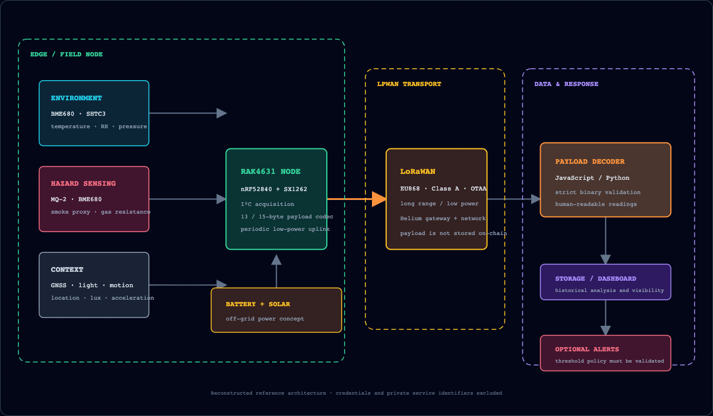

# Nature and Facilities Protector

[](https://github.com/itstofi/nature-facilities-protector/actions/workflows/ci.yml)
[](LICENSE)

A security-clean reconstruction of my 2024 Computer Engineering final-year project at the
University of Nicosia: a modular, solar-assisted IoT prototype for environmental monitoring and
early hazard indication using WisBlock sensors, a RAK4631 edge node, and LoRaWAN connectivity.

> **Academic prototype — not a certified life-safety system.** This repository is suitable for
> learning, payload interoperability, and portfolio review. It is not a certified smoke detector,
> fire alarm, gas detector, or production emergency-notification service.



## What is public here

- a credential-free RAK4631 + BME680 LoRaWAN reference sketch
- a local MQ-2 smoke-alarm experiment with explicit calibration warnings
- one shared, host-testable C++ payload codec
- matching Python and JavaScript decoders
- cross-language tests built around a recorded thesis-compatible packet
- a repository credential scanner
- a thesis-derived evaluation summary for indoor, urban-outdoor, and forest tests
- an accessible [HTML case study](docs/case-study.html) and generated
  [public case-study PDF](docs/case-study.pdf)

The raw thesis and historical working sketches are intentionally **not** published. They contain
historical network credentials/device identifiers and vendor-derived figures or examples. See
[SECURITY.md](SECURITY.md), [PROVENANCE.md](PROVENANCE.md), and [docs/THESIS.md](docs/THESIS.md).

## System pipeline

1. Modular sensors capture temperature, humidity, pressure, gas resistance, smoke-related values,
   light, motion, and location context.
2. A RAK4631 node converts readings into a compact binary payload.
3. LoRaWAN transports the payload through gateway/network infrastructure such as Helium.
4. A decoder reconstructs human-readable values.
5. Storage/dashboard and alert layers can consume validated readings.

Helium is used here as a LoRaWAN connectivity network with blockchain-incentivized coverage. The
project does **not** claim that raw sensor records are stored on-chain.

### Historical thesis backend

The 2024 prototype used a JavaScript decoder, Google Forms/Sheets for experimental logging, a
Python/Kivy display, and optional threshold-based SMS notifications. Those historical cloud/UI
files are not reproduced because they depended on private service-account configuration, Sheet
identifiers, local paths, and personal notification details. The public repository focuses on the
sanitized firmware and interoperable payload boundary; a production backend remains future work.

## Payload format

The thesis contains two compatible big-endian variants: a **13-byte historical frame** and a
**15-byte extension** that appends battery millivolts. Both use an unsigned centi-degree
temperature field. The public codec preserves that deployed behavior and rejects negative
readings instead of silently wrapping them.

| Offset | Bytes | Field | Scale |
| ---: | ---: | --- | ---: |
| 0 | 1 | message type | `0x01` |
| 1 | 2 | unsigned temperature | ÷100 °C |
| 3 | 2 | relative humidity | ÷100 % |
| 5 | 4 | pressure | ÷100 hPa |
| 9 | 4 | gas resistance | Ω |
| 13 | 2 | battery voltage | mV |

The first 13 bytes form the historical frame:

```text
010b0913880001767100018836
```

The related battery extension appends `0f0a` (3,850 mV):

```text
010b09138800017671000188360f0a
```

Both decode to 28.25 °C, 50% RH, 958.57 hPa, and 100,406 Ω. Decoders also reject
correct-length frames whose values fall outside documented sensor bounds: 0–85 °C, 0–100% RH,
300–1100 hPa, 1–100,000,000 Ω, and 0–6,000 mV when battery data is present.

## Run the hardware-independent checks

Requirements:

- Python 3.11+
- Node.js
- a C++17 compiler

```bash
python -m pip install -r requirements-dev.txt
make verify
```

Or run each layer:

```bash
pytest -q
node decoder/decoder.test.js
c++ -std=c++17 -Ifirmware/nfp_environment_node tests/cpp/test_payload.cpp -o /tmp/nfp-payload-test
/tmp/nfp-payload-test
c++ -std=c++17 -Ifirmware/nfp_smoke_alarm tests/cpp/test_smoke_policy.cpp -o /tmp/nfp-smoke-policy-test
/tmp/nfp-smoke-policy-test
python scripts/check_no_secrets.py
python -m tools.summarize_evaluation
```

The tests do not require a LoRaWAN account, cloud service, Arduino board, or physical sensor.

## Firmware reference

See [firmware/README.md](firmware/README.md). The environment sketch expects a private
`credentials.h` copied from `credentials.example.h`. Real credentials are ignored by Git and the
sketch refuses to join while the application key remains all zeroes.

Both sketches are compiled in CI against `rakwireless:nrf52` 1.3.3 with pinned Arduino library
versions. Compilation verifies the public firmware boundary without requiring live credentials or
physical hardware. Actual sensor behavior, radio joins, calibration, and power operation still
require bench testing on the target modules.

Verified local builds with Arduino CLI 1.5.1:

| Sketch | Flash | Dynamic memory |
| --- | ---: | ---: |
| Environment + LoRaWAN | 65,844 bytes (8%) | 10,640 bytes (4%) |
| MQ-2 smoke alarm | 54,348 bytes (6%) | 9,444 bytes (3%) |

## Thesis-reported evaluation ranges

These are student-prototype observations, not independently certified sensor-performance results.

| Environment | Temperature | Humidity | Pressure | Gas resistance | Observation |
| --- | ---: | ---: | ---: | ---: | --- |
| Indoor | 36.81–38.03 °C | 15–38% | 973.64–976.11 hPa | 99,191 Ω | one 15% entry has a different date |
| Urban outdoor | 47.87–47.91 °C | 7% | 980.41–980.49 hPa | 3,458,210–3,716,250 Ω | hot, low-humidity recorded condition |
| Forest | 14.43–14.46 °C | 67% | 1016.72–1016.78 hPa | 190,015–205,712 Ω | cooler, more humid condition |

Machine-readable source: [`data/evaluation_summary.csv`](data/evaluation_summary.csv).

## Limitations

- The prototype was not tested or certified to fire-alarm, gas-detection, or life-safety standards.
- MQ-2 thresholds require gas-specific calibration and controlled validation.
- The recorded dataset is limited and should not be treated as a long-duration field study.
- Gateway coverage, backend availability, and alert delivery can fail independently.
- Enclosure/weather resistance, tamper protection, secure provisioning, power optimization, and
  durable observability remain future engineering work.
- Historical credentials must be rotated before any original node/application is reused.

## Repository map

```text
firmware/             Credential-free reference sketches and shared C++ codec
decoder/              JavaScript decoder and tests
nfp/                  Python codec and evaluation tools
tests/                Python and host C++ tests
data/                  Sanitized thesis-reported evaluation summary
docs/                  Architecture, public case study, and safe output evidence
scripts/               Credential scanning
```

## Attribution and license

The prototype used RAKwireless WisBlock hardware and third-party sensor libraries. Vendor examples
from the private student folder are not redistributed. See [PROVENANCE.md](PROVENANCE.md) for the
full boundary and acknowledgements.

Original code and documentation in this public reconstruction are released under the
[MIT License](LICENSE). Third-party board support and libraries remain under their own licenses.
